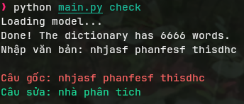

# VSC

## Demo

[](https://www.youtube.com/watch?v=dQw4w9WgXcQ)

## Setup

```fish
git clone git@github.com:hnqv313/VSC.git
cd VSC
pip install -r requirements.txt
```

## Run

### Print help

```fish
python main.py --help
```

### Training

```fish
python main.py train --help
```

### Checking

```fish
python main.py check --help
```

### Tuning

Write custom code to evaluate the model. You can see the example in `tune.py`,
run `python tune.py`.

For details on configuration and available hyperparameters, see `config.py`.
